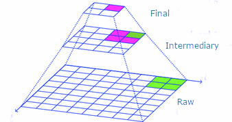

## What Is Our Purpose?

- To extract insight from data to generate the answers decision makers need to move forward

- What could we accomplish if we had the right answers to the right questions at the right time?

- > Data Science is the process of turning data into knowledge, understanding and insight. ~Hadley Wickham (RStudio Chief Data Scientist)

- > If I had asked people what they wanted, they would have said faster horses. ~Henry Ford

## How We Extract Insight?

- Data needs to be the foundation

- Build in Transparency at all levels

<aside class="notes">
- Create clarity, accuracy and understanding
- A proper foundation allows understanding of context
</aside>

  

## What Do We Offer?

- Tidying - Making large/unstructured/messy data usable

- Discovery - Learning about the past by letting the data speak for itself

- Modeling - Simulating scenarios for real-time results to proactively get ahead of the curve

- Forecasting - Seeing where your trends are taking you

- Interpretation - Understanding what the results mean

- Visualization - Composing static/interactive graphics that tell compelling stories

- Communication - Providing actionable insights that show a clear path forward

## How Do Others Benefit?

- Automated analysis/reporting

- Real-time results

- Recommendations on path forward

- NAVAIR Specific Examples
  - Test
  - Program/Contracts

## Example
<video width="100%" height="600" controls id="video">
<source src="Stock App 2018.07.24.mp4" type="video/mp4" >
</video>

<a href = "https://bellerosejoey.shinyapps.io/StockApp/">Stock Application</a>

## What Is Our Collective Experience?

- Combined 20 years of working on NAVAIR projects
  - PMA-201
  - PMA-280
  - PMA-281
  - PMA-209

- Tools
  - Excel
  - Matlab
  - R
  - Tableau
  - Qlik
  - Python
  

# What Is Our Path Forward?

## How Can We Help Others?
- Potential Customers
  - MALD - Data Post-Processing
  - FXDO - Automated Reporting
  - COTF - Automated Reporting
  - Contracts (2.4) - Real-time Dashboards
  - Contracts (2.0) - Portfolio Analysis
  - PMA-280 - Real-time Modeling
  - PEO U&W - Portfolio Digitization & Management
  - PMA-234 ?
  - PMA-290 ?
  - DT ?
  - VX-9 ?

## What Are We Working Through?
- Incubating/Mentorship under established company

  - Business Operations
  - Business Plan

- Subcontract under existing Prime

  - Combine Prime's domain expertise with our analytical understanding

